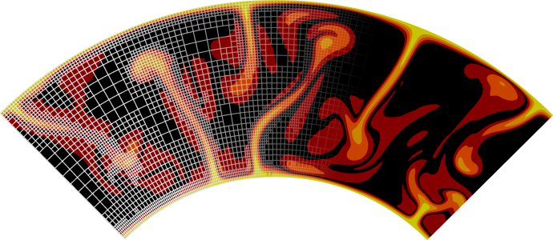

About me
======

I am a Professor at GEOMAR Helmholtz Centre for Ocean Research Kiel and Kiel University.
I am a geodynamicist, and I develop mathematical and computational models of the Earth's interior that can help us understand how the Earth's surface has evolved. In my research, I am particularly interested in the processes that cause rocks in the Earth's deep interior to deform, the creation and evolution of oceanic plates, the formation of oceanic islands, and how these processes are connected to volcanism.

Software
------
I am one of the principal developers and maintainers of the free modeling software [ASPECT](https://aspect.geodynamics.org) (Advanced Solver for
Problems in Earth's Convection). ASPECT uses modern numerical methods to support research in simulating convection in the Earth's mantle and elsewhere.

